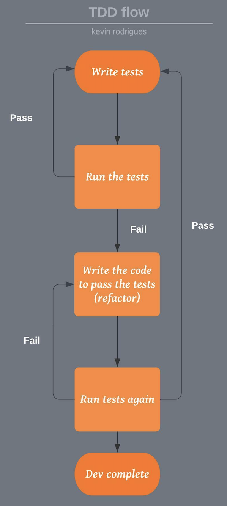

## What is Test-Driven Development (TDD)?

---

In a nutshell, Test-Driven Development (TDD) is a software development practice that focuses on creating unit test cases before developing the actual code for your application. If you are new to testing of any kind or even if you're a seasoned developer, this can be a super difficult concept to grasp and wrap your brain around.

The main aim of adopting a TDD approach is to help enable engineers & testers to optimise code that holds up to resilience long term. Test Driven Development ultimately is the process where you write a test that fails at first, and then write the code that makes this failed test pass. In a way this forces you to think about the implementation details of the code you are about to write.

## My 3 steps to TDD

---

1. Write the tests.
2. Write the code in-order for the tests pass.
3. Go back and refactor the code so it is as optimised as possible, then make sure the functionality still works as intended!

## Benefits of TDD

---

1. Minimal code output.
2. Adding tests later become easier once a feature has been developed.
3. TDD ensures code coverage is near 100% or as close as possible as tests are written first.
4. Easier to maintain a codebase with tests which also double up as documentation for newer developers making changes.

## Summary

---

Test-driven development offers more than just simple validation of code, but can also drive the application design. Taking a TDD approach ensures engineers are concerned with the interface before the implementation details. TDD can also lead to more modularised, flexible, and extensible code.

There are some limitations to TDD, Unit tests created in a test-driven development environment are usually created by the developer who is writing the code being tested. Therefore, the tests may share blind spots if the developer misinterprets the requirements for the module they are developing, the code and the unit tests they write will both be wrong in the same way. Therefore, the tests will pass, giving a false sense of correctness.
