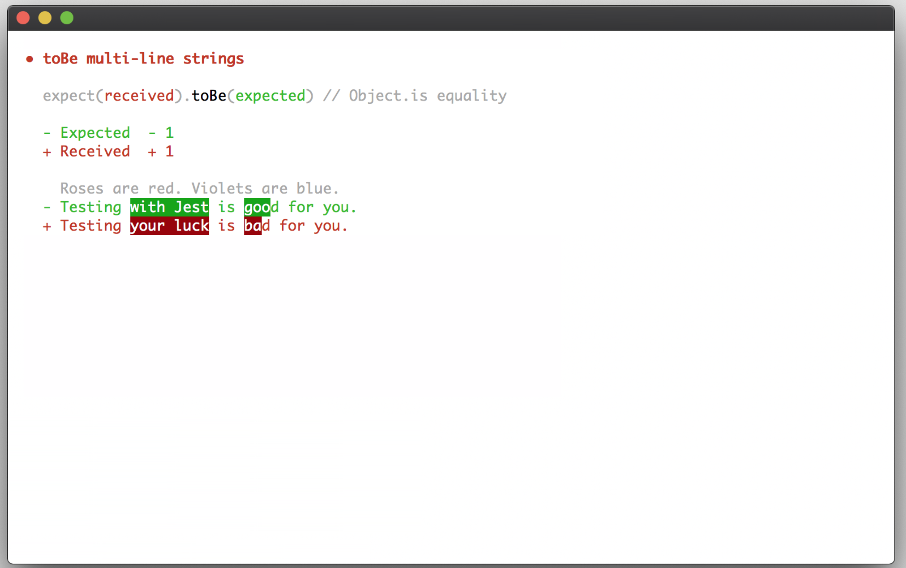
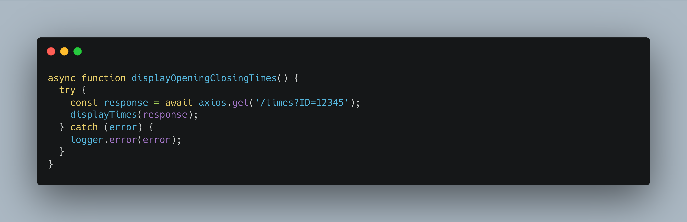
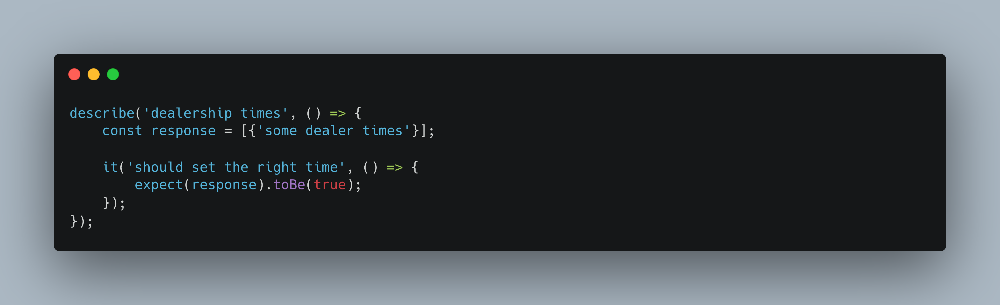

I was aware of unit testing early on in my engineering career. My first hands on experience to the concept came initially from a [PR](https://docs.github.com/en/pull-requests/collaborating-with-pull-requests/proposing-changes-to-your-work-with-pull-requests/about-pull-requests) aka 'Pull Request' or 'Peer Review' comment. At that time I had absolutely no knowledge of how to unit test my code, what to look for or even where to start when it came to unit testing. The PR comment read something along the lines of `Any Tests to accompany these changes at all??`. Needless to say, the PR was declined.

## PR panic setting in..

---

I quickly discovered that my PR was going to take longer than anticipated. In a state of panic (as I was fairly new in the company), I went away that night and read a unit testing book (JavaScript Testing with Jasmine JavaScript Behavior-Driven Development) back to front and came back the next day and wrote a bunch of tests to cover the Javascript changes in my PR, or so I thought.

I know what you're thinking.. Why didn't I just say I didn't know how to unit test?? The answer is I don't really know why.. I think it was a mixture of thinking I `should` know this particular thing as an engineer and also wanting to set myself a challenge to learn it. I know from the agency that I was at where this happened there was a strong ethos of tests in PRs, `no tests = no approvals = no merge`.

From what I remember, and to give you a rough idea of the changes I requested for review (without the tests), it was essentially a simple function that called an API and passed the response as an argument to another method to display a list of opening / closing times for car dealerships.

## My attempt at writing unit tests..
---

Looking back at it now it was quite poor for lack of experience. I basically spent a night reading a unit test book and came back the next day to write what I thought was sufficient enough unit tests. The engineer that pointed out the missing unit test in my PR basically ripped through my first attempt (in a nice way). This urged me to try and learn it properly this time around. I don't actually remember how I wrote those particular tests but it was something along the lines of:

Anyone that knows unit testing knows this particular bit of code isn't really testing anything. It will pass, for no good reason, and that's about it! I suppose on the plus side I did grasp the very basics of how to work with `describe` & `it` blocks but my actual theory wasn't there. I eventually asked the engineer to pair with me to complete the tests and as a result we worked together on larger tasks and I ended up learning a great deal from him.

## Summary..
---

I suffer from imposter syndrome, as do many other engineers, and I think that probably played a large part in my first experience. Saying that though there was one key take away I've learnt from this type of experience.

1. Don't be afraid to say you don't know something.. it is ok (something I didn't appreciate at the time). In fact I would highly encourage it, good engineers always look to help others, from my experience anyway! You will probably learn more from a pairing session than from any book (IMHO).

I will cover how I prefer to write unit test (in a TDD manner) in another blog post.

